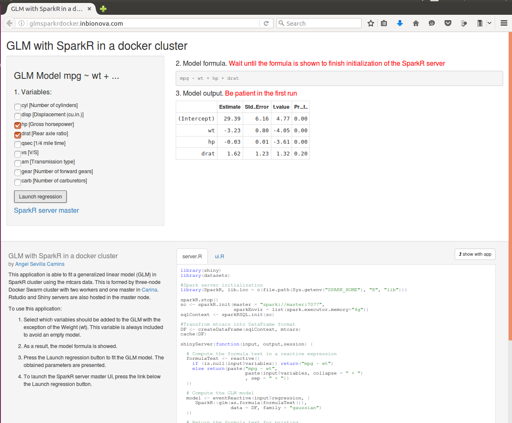

# Spark, RStudio and Shiny servers in a docker cluster hosted by Carina

## Summary
This repository contains the necessary files for setting up a Spark cluster based on Docker in which Rstudio and Shiny servers are included.  This cluster can be hosted in a docker environment such as [Carina](https://getcarina.com) based on Docker Swarm. Moreover, a toy shiny application is included to test its functionality.

## Introduction
SparkR is an R package designed to use Apache Spark from the R command line and to allow distributed computations on large datasets. Importantly, the distributed machined learning library MLlib can be utilized in SparkR. For training proposes, SparkR can be run in "standalone mode," which means using a single node, probably your own computer. My personal experience is that not all the programs or applications developed in standalone mode will work in a fully integrated cluster mode. Therefore, SparkR should be deployed in a cluster to obtain its full potential. 

Even though AWS, Google Cloud, Microsoft Azure and others providers offer interesting quotes, it would be better if SparkR could be run in a cloud environment for free.

Docker is an open source project to automatically deploy applications into  "containers". These containers are based on images which contain a root file system and several execution parameters to constitute an independent virtualized operating system. From the docker [website](https://docs.docker.com): "The concept is borrowed from Shipping Containers, which define a standard to ship goods globally. Docker defines a standard to ship software".

Carina is a docker environment based on Docker Swarm and it can be used to deploy an application using docker containers in a cluster. Each cluster of Carina is composed of 3 nodes with a memory capacity of 4 GB and 12 vCPUs each, thus, every cluster has total 12 GBs of RAM and 36 vCPUs. Carina offered free accounts at the time when this file was written (20/07/2016). For more details, go to the Carina [website](https://getcarina.com).

Furthermore, RStudio and Shiny servers can be hosted simultaneously in the same cluster to test our SparkR applications and even publish them.

## Getting started

To get started in 15 minutes, follow the subsequent instructions. For a more detailed description, go to [here](https://github.com/angelsevillacamins/spark-rstudio-shiny/wiki/spark-rstudio-shiny-docker-image-in-detail).

1. Sign up for the Carina Beta [here](https://app.getcarina.com/app/signup).

2. Create a Carina cluster and scale up to **3 nodes**

3. Connect to your Carina cluster as explained in [here](https://getcarina.com/docs/getting-started/getting-started-on-carina).
If everything runs smoothly, you should see something like this after the `docker info` command :
  ```
  $ docker info
  Containers: 5
   Running: 3
   Paused: 0
   Stopped: 2
  Images: 5
  Server Version: swarm/1.2.0
  Role: primary
  Strategy: spread
  Filters: health, port, dependency, affinity, constraint
  Nodes: 1
   1dba0f72-75bc-4825-a5a0-b2993c535599-n1: 172.99.70.6:42376
    └ Status: Healthy
    └ Containers: 5
    └ Reserved CPUs: 0 / 12
    └ Reserved Memory: 0 B / 4.2 GiB
    └ Labels: com.docker.network.driver.overlay.bind_interface=eth1, executiondriver=, kernelversion=3.18.21-2-rackos, operatingsystem=Debian GNU/Linux 7 (wheezy) (containerized), storagedriver=aufs
    └ Error: (none)
    └ UpdatedAt: 2016-05-27T19:27:24Z
    └ ServerVersion: 1.11.2    
  ```
4. Run the following commands:
  ```sh      
  ## Define a network
  docker network create spark_network
  
  ## Create data volume container with a folder to share among the nodes
  docker create --net spark_network --name data-share \
    --volume /home/rstudio/share angelsevillacamins/spark-rstudio-shiny
    
  ## Deploy master node
  docker run -d --net spark_network --name master \
    -p 8080:8080 -p 8787:8787 -p 80:3838 \
    --volumes-from data-share \
    --restart=always \
    angelsevillacamins/spark-rstudio-shiny /usr/bin/supervisord --configuration=/opt/conf/master.conf
    
  ## Changing permissions in the share folder of the data volume
  docker exec master chmod a+w /home/rstudio/share
  
  ## Deply worker01 node
  docker run -d --net spark_network --name worker01 \
    --volumes-from data-share \
    --restart=always \
    angelsevillacamins/spark-rstudio-shiny /usr/bin/supervisord --configuration=/opt/conf/worker.conf
    
  ## Changing permissions in the share folder of the data volume
  docker exec worker01 chmod a+w /home/rstudio/share
  
  ## Deploy worker02 node
  docker run -d --net spark_network --name worker02 \
    --volumes-from data-share \
    --restart=always \
    angelsevillacamins/spark-rstudio-shiny /usr/bin/supervisord --configuration=/opt/conf/worker.conf
    
  ## Changing permissions in the share folder of the data volume
  docker exec worker02 chmod a+w /home/rstudio/share
  ```
  
  After each docker run command, you should see the volume name such as:
  ```
  c3673ae185b6966d77d193365e8ede1017f4c5a8c4543564565465677e65bd61e
  ```

5. Check master external IP with the following command:
  ```sh
  docker ps
  ```
or go to the Carina Clusters page and press Edit Cluster. The IP should be in the Containers description of your master node:
  ```
  8787 → 146.20.00.00:8787
  8080 → 146.20.00.00::8080
  3838 → 146.20.00.00:80
  ```
6. Launch your favorite web browser and use the previous addresses, taking into account that:

    - **Shiny server** should be directly accessible with the IP, thus, http://your.ip.as.above.

    - **Spark server** should be accessible using the port 8080, thus, http://your.ip.as.above:8080.

    - **R Studio server** should be accessible using the port 8787, thus, http://your.ip.as.above:8787.

## glm-sparkr-docker: a Shiny application example

Once that shiny server has been checked with the default page, we are going to upload a very simple example but able to use SparkR.

This application is contained in the zip file `GLM SparkR shiny app.zip`.

To upload this application to the Shiny server:

1. Open a RStudio server session with http://your.ip.as.above:8787.

1. Password and user are rstudio.

1. In the right bottom corner of the RStudio session, go to the shiny-server folder in which all the default shiny applications are stored. You should see the folders:
```
01_hello
02_text 
03_reactivity
...
```
**If you don't see these folders, you are in the wrong folder, please DO NOT proceed with the next step.**

4. Check all of them and press `Delete`

5. Press `Upload` and select the `GLM SparkR shiny app.zip` file which should be in the github folder where you have forked this repository.

6. Go to http://your.ip.as.above and you should see the GLM with SparkR in a docker cluster application.

### To use this application:

1. Wait until SparkR is initialized. This operation takes about a minute, so **PLEASE BE PATIENT**. As a result, the model formula is shown.

1. Select which variables should be added to the linear model with the exception of the Weight (wt). This variable is always included to avoid an empty model. 

1. Press the Launch regression button to fit the linear model. 
**PLEASE BE PATIENT**, the first time takes about 30 seconds.

1. The obtained parameters are shown.

1. This operation can be repeated with different combinations of variables.

1. To launch the SparkR server master UI, press the link below the launch regression button.

1. Close the application web page to stop the SparkR connection.

If you can't wait, you can test this application using this [link](http://glmsparkrdocker.inbionova.com/).



## Status

This is work in progress. For collaborations or feedback, you can contact me by email at [asevilla@inbionova.com](mailto:asevilla@inbionova.com).

## Licensing

The files in this repository are licensed under the Apache License, Version 2.0. 

## Trademarks

RStudio is a registered trademark of RStudio, Inc. The use of the trademarked term RStudio and the distribution of the RStudio binaries through the images hosted on [hub.docker.com](https://hub.docker.com) has not been granted yet but explicit permission of RStudio has been requested. Please review [RStudio's trademark use policy](http://www.rstudio.com/about/trademark/) and address inquiries about further distribution or other questions to [permissions@rstudio.com](mailto:permissions@rstudio.com).